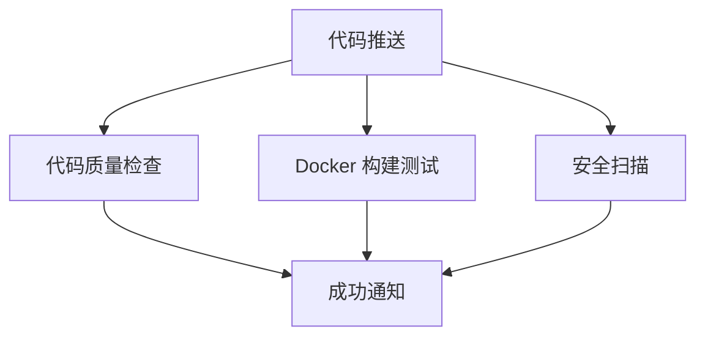
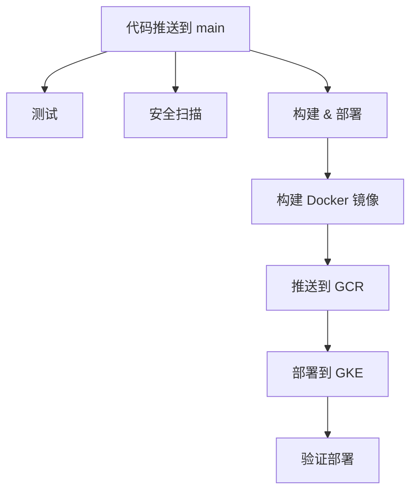

# GitHub Actions Setup Guide

## 🎯 概述

这个指南将帮你为 SentimentSense 项目设置 GitHub Actions CI/CD pipeline。

## 📋 前置条件

1. **GitHub 仓库** - 你的代码需要在 GitHub 上
2. **GCP 项目** - 用于部署
3. **GKE 集群** - 已经创建的集群

## 🔧 设置步骤

### 1. 创建 GitHub 仓库

如果还没有，创建 GitHub 仓库：
```bash
# 在项目根目录
git init
git add .
git commit -m "Initial commit"
git branch -M main
git remote add origin https://github.com/YOUR_USERNAME/SentimentSense.git
git push -u origin main
```

### 2. 创建 GCP 服务账号

```bash
# 设置变量
export PROJECT_ID="your-project-id"
export SA_NAME="github-actions-sa"

# 创建服务账号
gcloud iam service-accounts create $SA_NAME \
    --description="Service account for GitHub Actions" \
    --display-name="GitHub Actions SA"

# 授予权限
gcloud projects add-iam-policy-binding $PROJECT_ID \
    --member="serviceAccount:$SA_NAME@$PROJECT_ID.iam.gserviceaccount.com" \
    --role="roles/container.developer"

gcloud projects add-iam-policy-binding $PROJECT_ID \
    --member="serviceAccount:$SA_NAME@$PROJECT_ID.iam.gserviceaccount.com" \
    --role="roles/storage.admin"

# 创建密钥
gcloud iam service-accounts keys create key.json \
    --iam-account=$SA_NAME@$PROJECT_ID.iam.gserviceaccount.com
```

### 3. 配置 GitHub Secrets

在 GitHub 仓库中设置 Secrets：

1. 进入 GitHub 仓库
2. 点击 **Settings** → **Secrets and variables** → **Actions**
3. 点击 **New repository secret**

添加以下 secrets：

| Secret Name | Value | 描述 |
|-------------|-------|------|
| `GCP_PROJECT_ID` | your-project-id | GCP 项目 ID |
| `GCP_SA_KEY` | key.json 的内容 | 服务账号密钥 |

### 4. 配置文件说明

项目中包含两个 GitHub Actions 工作流：

#### 📁 `.github/workflows/simple-ci.yml`
**简单的 CI 流程**（推荐学习使用）
- ✅ 代码质量检查
- ✅ Docker 构建测试
- ✅ 安全扫描
- ✅ 成功通知

#### 📁 `.github/workflows/deploy.yml`
**完整的 CI/CD 流程**（生产环境使用）
- ✅ 所有 CI 检查
- ✅ 自动部署到 GKE
- ✅ 滚动更新

## 🚀 使用方法

### 触发 CI/CD

1. **推送代码到 main 分支**
   ```bash
   git add .
   git commit -m "Update application"
   git push origin main
   ```

2. **创建 Pull Request**
   - 会触发所有检查
   - 但不会部署

### 查看结果

1. 进入 GitHub 仓库
2. 点击 **Actions** 标签
3. 查看工作流运行状态

## 📊 工作流详解

### Simple CI 工作流



### 完整 Deploy 工作流



## 🔍 监控和调试

### 查看日志
1. GitHub Actions 页面查看详细日志
2. 每个步骤都有详细输出

### 常见问题

#### 1. 权限错误
```
Error: failed to get credentials
```
**解决**: 检查 GCP_SA_KEY secret 是否正确设置

#### 2. 集群连接失败
```
Error: cluster not found
```
**解决**: 确保集群名称和区域正确

#### 3. Docker 构建失败
```
Error: failed to build image
```
**解决**: 检查 Dockerfile 语法和依赖

## 🎯 最佳实践

### 1. 分支策略
- `main` 分支：自动部署到生产环境
- `develop` 分支：部署到测试环境
- 功能分支：只运行 CI 检查

### 2. 安全考虑
- 永远不要在代码中硬编码密钥
- 使用 GitHub Secrets 存储敏感信息
- 定期轮换服务账号密钥

### 3. 成本控制
- CI/CD 运行会消耗 GitHub Actions 分钟数
- 免费账户每月有 2000 分钟
- 优化工作流以减少运行时间

## 🧪 测试 GitHub Actions

### 本地测试
使用 `act` 工具在本地测试 GitHub Actions：
```bash
# 安装 act
brew install act  # macOS
# 或
curl https://raw.githubusercontent.com/nektos/act/master/install.sh | sudo bash

# 运行工作流
act -j code-quality
```

### 手动触发
在 GitHub Actions 页面可以手动触发工作流进行测试。

## 📈 下一步

1. **监控**: 设置 Slack/Email 通知
2. **环境**: 添加 staging 环境
3. **测试**: 增加更多自动化测试
4. **安全**: 添加更多安全扫描工具

## 🆘 故障排除

如果遇到问题：
1. 检查 GitHub Actions 日志
2. 验证 GCP 权限
3. 确认集群状态
4. 查看 Kubernetes 事件

记住：CI/CD 是一个迭代过程，从简单开始，逐步完善！
